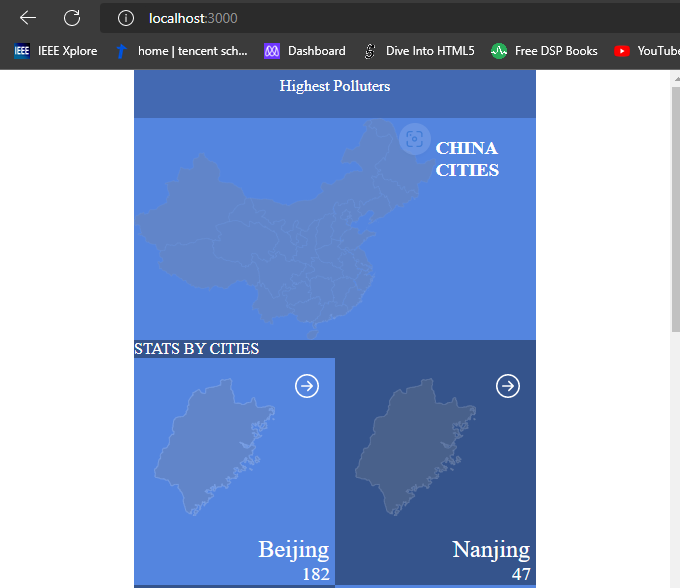

# China Air Quality Application

> Air quality info site made by using AQI API for cheking the Air quality of surrounding cities. Can be used for forecsting and also as a travel waring toolkit

## Built With

- Javascript
- JSX
- CSS
- Markdown
- React

## Live Deployment

> The website is built using React and deployed using Netlify

[China Air Quality Link](https://illustrious-gnome-9b4dcd.netlify.app/)

## Getting Started

**Set up a linter for HTML, CSS and JS**

To get a local copy up and running follow these simple example steps.

1. Clone this repository or download the Zip folder:

**``git clone git@github.com:tinatsina/math-magicians-online.git``**

1. Navigate to the location of the folder in your machine:

**``you@your-Pc-name:~$ cd <folder>``**

**Git**
**Node JS (preferably any LTS version) for linters**

## Author

👤 **Tinaye Hamufari Tsinakwadi**

> Aspiring web developer mainly interested in minimal code. Research interests include Database design and IOT.

- [GitHub](https://github.com/tinatsina)
- [Twitter](https://twitter.com/TinayeT)
- [LinkedIn](https://www.linkedin.com/in/tinayetsina/)

Please feel free to contact us anytime

## Show your support

Give a ⭐️ if you like this project!

## Acknowledgments

- Original design idea by [Nelson Sakwa on Behance.](https://www.behance.net/sakwadesignstudio)

## 📝 License

- This project is [Mozilla](./LICENSE) licensed.
